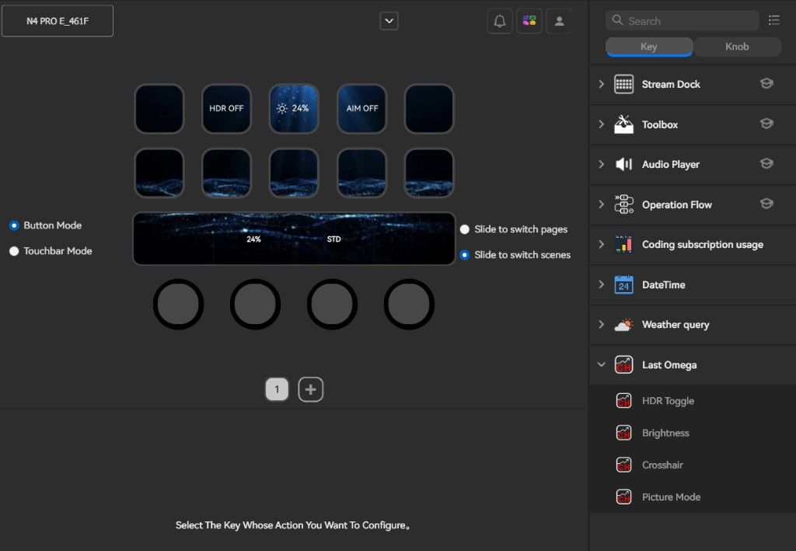
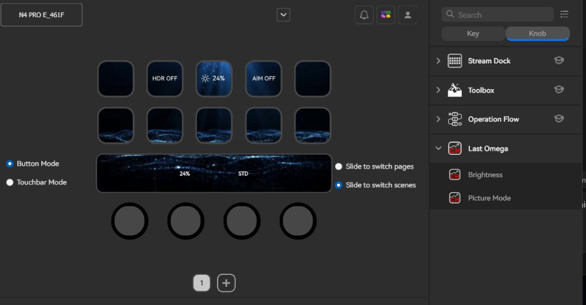
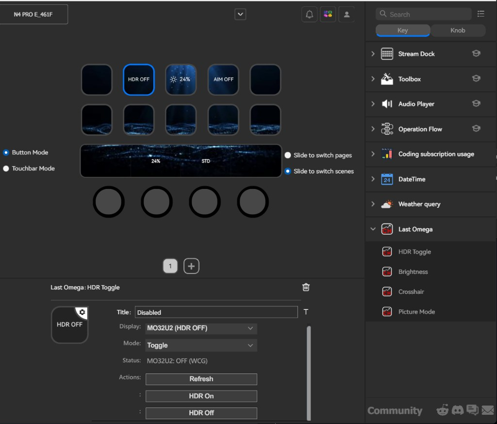

# Last Omega

<p align="center"><strong>MO32U2 под рукой — крутилки, не меню OSD.</strong></p>

Плагин **Stream Dock** для **MiraBox N4 Pro**, специально под монитор **Gigabyte MO32U2**:
HDR, яркость, прицел, профили «Графика» и герцовка — без походов в экранное меню.

Проверено на связке: **MiraBox N4 Pro** + **Gigabyte MO32U2**.

[English](../README.md) · **Русский** · [中文](README.zh-CN.md)

---

## Возможности

| Действие | Назначение |
|----------|------------|
| **HDR** | Вкл/выкл Windows HDR для MO32U2 |
| **Яркость** | В SDR — `%`, в HDR — **nits** SDR-контента; одна крутилка |
| **Прицел** | AIM на панели через Sidekick HID |
| **Графика** | Профили Picture Mode с превью при вращении и установкой после паузы |
| **Герцовка** | Текущая частота обновления на Key (`240Hz`), интервал опроса настраивается |

## Галерея

<p align="center">
  
  
  
</p>

## Требования

- **Только Windows 11**
- Устройство: **MiraBox N4 Pro** (Stream Dock; основной таргет)
- Приложение Stream Dock **≥ 3.10.188.226**
- Runtime плагина: **Node.js 20** (идёт в комплекте со Stream Dock)
- Монитор: **Gigabyte MO32U2** (основной проверенный дисплей)
- Gigabyte Control Center / OSD Sidekick (прицел и «Графика»)

### Для какого железа

| Что | Модель |
|-----|--------|
| Контроллер | **MiraBox N4 Pro** — клавиши и крутилки |
| Дисплей | **Gigabyte MO32U2** — HDR, яркость, прицел, «Графика», герцовка |

## Установка из готового пакета

Полная инструкция: **[INSTALL.ru.md](INSTALL.ru.md)** ([EN](INSTALL.md) · [中文](INSTALL.zh-CN.md))

1. Скачайте `LastOmega-<версия>-windows.zip` из [Releases](../../releases/latest)
2. Закройте Stream Dock
3. Распакуйте папку `com.mirabox.streamdock.lastomega.sdPlugin` в:

```text
%APPDATA%\HotSpot\StreamDock\plugins\
```

4. Запустите Stream Dock → категория **Last Omega**

```powershell
.\scripts\install-release.ps1 -ZipPath .\dist\LastOmega-0.5.5-windows.zip
```

## Сборка из исходников

```powershell
cd com.mirabox.streamdock.lastomega.sdPlugin\plugin
npm ci
cd ..\..\..
.\scripts\deploy.ps1          # установка для разработки
.\scripts\pack.ps1            # zip для сообщества → dist\
```

## Стек

- Stream Dock SDK (WebSocket `ws`, Node 20)
- HDR — Windows DisplayConfig
- Яркость — DDC/CI + API яркости SDR в HDR
- Прицел / Графика — USB HID Sidekick (`VID_0BDA&PID_1100`)
- Герцовка — DisplayConfig refresh rate (Hz), привязка к стандартным режимам панели

## Лицензия

[MIT](../LICENSE) — **бесплатно для всех**: можно скачивать, использовать, менять и распространять как угодно (в т.ч. свои форки), достаточно сохранить уведомление об авторских правах.

### Авторы

| Роль | Кто |
|------|-----|
| Руководство, решения, тесты на **N4 Pro + MO32U2** | **R4444H** |
| Реализация (код, документация, пакеты) | **Cursor AI** под руководством R4444H |

Распространяется по лицензии **[MIT](../LICENSE)** — можно свободно использовать, копировать, изменять, объединять, публиковать, распространять, сублицензировать и/или продавать копии этого ПО.
